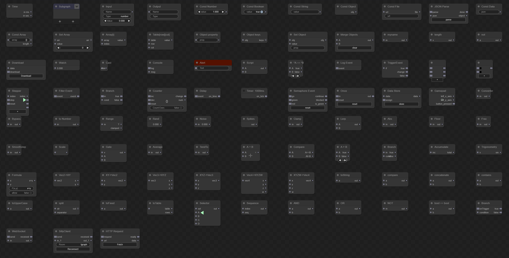

# StoneSoup: A Plugin-Centric AI Workflow Platform

## Working in Progress, please support us!


## Our Vision

StoneSoup is an open-source, flexible platform for AI workflows and experimentation. Built on [LiteGraph](https://github.com/jagenjo/litegraph.js), it emphasizes plugin-centric development and easy testing of various AI methods and parameters. Our goal is to provide a powerful, user-friendly environment for AI innovation.

## Why StoneSoup?

While [ComfyUI](https://github.com/comfyanonymous/ComfyUI) has set a high standard in the field of AI workflow interfaces, StoneSoup offers an alternative approach. We differentiate ourselves in several key areas:

1. **Open License**: StoneSoup uses the MIT license, providing maximum flexibility for developers and businesses. This contrasts with ComfyUI's GPL-v3 license.

2. **Advanced Flow Control**: We introduce separate execution and data flows, enabling complex workflows with loops and conditional branching. ComfyUI, in comparison, combines data flow with execution flow.

3. **Plugin-Centric Architecture**: Our core focus is on fostering a robust plugin ecosystem. We provide minimal default nodes, concentrating our efforts on supporting community-developed plugins. This differs from ComfyUI's approach of providing many core functionalities.

4. **Comprehensive Plugin Support**: StoneSoup plugins can include server-side Python code, browser-side JavaScript, and AI models, offering developers greater control. ComfyUI primarily recommends Python-only custom nodes and provides limited model management support.

## Our Commitment

We embark on this journey with respect for ComfyUI and other projects in this space. Our goal is to offer an alternative that may better suit certain use cases and development philosophies, not to replace existing tools.

We invite developers, AI enthusiasts, and anyone curious about community-driven software to join the StoneSoup project. Let's explore the potential of this plugin-centric approach together.

## Acknowledgments

We are grateful to the [ComfyUI](https://github.com/comfyanonymous/ComfyUI) team and community. Their innovative work has been a significant inspiration and has greatly contributed to advancing AI workflows.

We also extend our thanks to the [LiteGraph](https://github.com/jagenjo/litegraph.js) project, which forms the foundation of both ComfyUI and StoneSoup. LiteGraph's MIT-licensed graph editor has been instrumental in enabling the creation of flexible, node-based interfaces for AI workflows.

## Your Support Matters

StoneSoup is in its early stages, and your involvement can shape its future! 

Every contribution counts:

- Open an issue to report bugs or suggest features
- Share your ideas and feedback in discussions
- Contribute code or documentation
- Help with multi-language support (中文, 日本語, 한국어, Français, Español, Deutsch, Русский, العربية, हिन्दी, Português, Italiano, ...)
- Spread the word about StoneSoup

Your input is crucial in guiding the direction of this project. No matter how small, your contribution can make a significant impact. Join us in building StoneSoup into a powerful, community-driven AI workflow platform.

Let's create something amazing together!

## All Built-in LiteGraph Nodes

LiteGraph has many built-in nodes, let's take a quick look at all of them:


Here is the nodes in the `mini` version (I think I'll use them more):



## Usage

This project is currently working in progress, this section might not work due to frequent change of source code.

Get the code and the submodule (LiteGraph)
```
git clone https://github.com/liusida/StoneSoup.git
git submodule update --init --recursive
```

Start the Python Server w/ auto-reload:
```
python server/main.py
```

Start the StoneSoup website w/ auto-reload:
```
python client/main.py
```

Access StoneSoup:
```
http://localhost:6166/
```

Add your first node, the `Start` node, and other nodes like `Upload Image` or `Preview Image` nodes.

## Plugins and Nodes

Put your Javascript plugins in the folder `./client/plugins/` and the system'll automatically load them into the client web.

Put your custom nodes in the folder `./nodes/` and they'll be automatically integrated to the system.

There are 3 kinds of nodes:

1. Pure Javascript nodes;

2. Pure Python nodes;

3. Javascript nodes with Python API entrypoints.

Examples can be found in `./node/example_custom_nodes/`.

P.S. Javascript files should be in `js` subfolder, Python files should be in `py` subfolders, in order to be automatically loaded.
